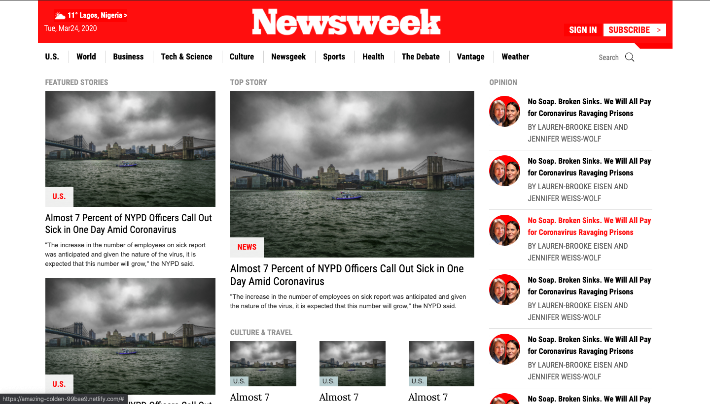
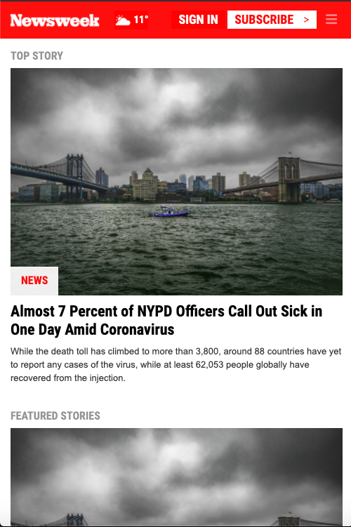

# responsive_newsweek

Response Design- The Next Web
  
# What it does  
  
It is a responsive clone of Newsweek (Newsweek).
  
## Screenshot

## Built With  
  
- Bootstrap
- HTML
- CSS
- Font Awesome

  
## Live Project  

  

## Getting Article Started  
You may use the following steps to get a local copy:
  
Clone project to your local machine  
cd to the project directory  
Open project in IDE/Text Editor  
Open Live Preview through IDE or use localhost to view the project in your browser  
  
## 🤝 Contributing
You are welcome to make contributions to the repository. Contributions may be made through issues comments and feature requests.

## 👤 Author

# Calvin
- GitHub [here](https://github.com/calvinoea/)
- Twitter: [@yasukeoz](https://twitter.com/yasukeoz)
- LinkedIn: [Calvin](https://www.linkedin.com/in/calvin-ebun-amu-9b200017a/)

## Show your support  
Give a ⭐️ if you like this project!

## 📝 License  
This project is MiT licensed.

